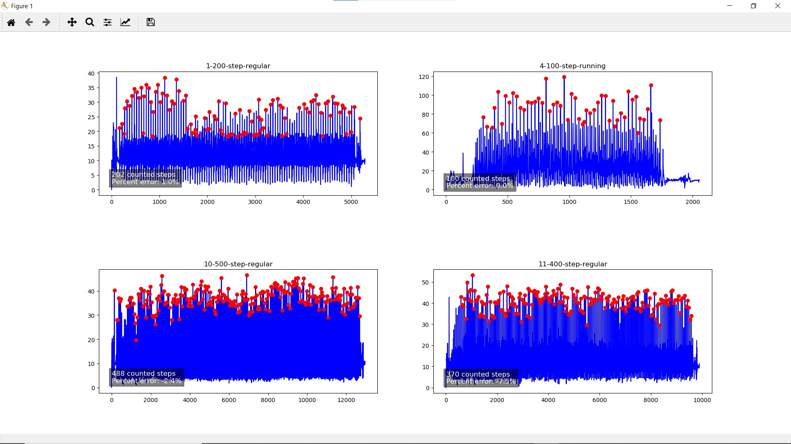

# Python Step Counter
A python function that counts the number of steps taken using acceleration data from a phone.

The function finds the: 
- mathematical minimums and maximums of the acceleration data
The function then: 
- analyzes the maxs and mins using their means and standard deviations to find the maximums that are associated with the peaks of a step

Counts regular and running steps with 96.67% accuracy
